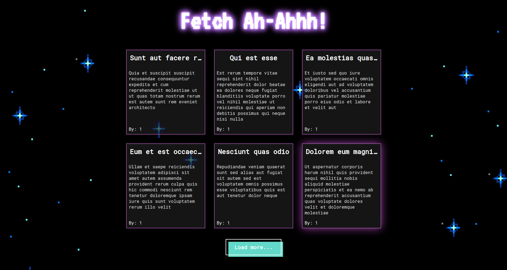

# fetch-ah-ahhh

Fetch-Ah-Ahhh is an 80s inspired blog display page created with **HTML, SCSS & JavaScript**.

Page uses fake blog posts fetched from the [JSONPlaceholder](https://jsonplaceholder.typicode.com/), a free online REST API and you can check it out [here](https://lara-isak.github.io/fetch-ah-ahhh/).

### :thumbsup: Motivation behind the project
- Understand how to use **fetch() method** to pull data from a specific API
- Learn how to write **more organized and reusable CSS** with a help from **SASS**

### :seedling: What I learned
:arrow_right: how to utilize **Sass variables** and **nesting** to write a more understandable CSS  
:arrow_right: how to use **async function** together with **fetch() & json() methods** to pull data and parse it to a JavaScript object  
:arrow_right: how to utilize **forEach() method** to create individual blog posts 
:arrow_right: how to sprinkle some **CSS Grid** magic and display evenly distributed, responsive blog posts 
:arrow_right: how to combine **flex & none values** of a **display property** with click EventListener to load additional posts

